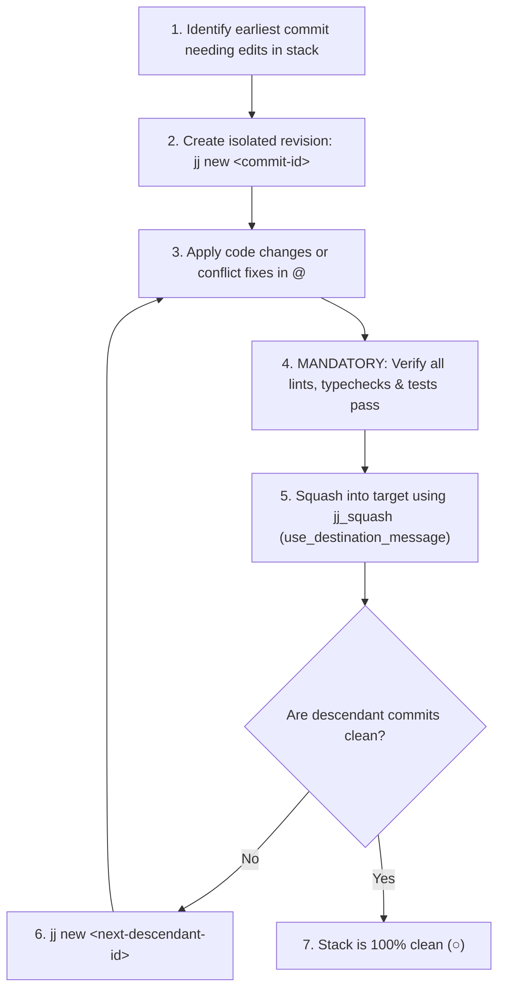

# Jujutsu (`jj`) Version Control & Stack Management

This skill establishes the comprehensive operating standard for managing repositories using [Jujutsu (`jj`)](https://github.com/martinvonz/jj). It mandates the use of `jj` MCP tools over shell commands, defines the mandatory bottom-up squash workflow for stack editing, establishes story-driven commit description standards, and provides conflict resolution protocols.

---

## 1. Core Version Control Rules

1. **NO GIT**: Never invoke `git` directly unless an operation is demonstrably impossible in both the `jj` MCP tools and shell `jj`.
2. **PRIORITIZE MCP TOOLS**: Always use the lazy-loaded `jj` MCP tools (`jj_status`, `jj_log`, `jj_diff`, `jj_show`, `jj_describe`, `jj_squash`, `jj_resolve`, `jj_file_show`, `jj_help`).
3. **SHELL JJ RESTRICTION**: Only invoke `jj` from the shell (`run_command`) for operations not covered by existing MCP tools (e.g. `jj new <commit-id>`, `jj bookmark ...`, `jj git push ...`).
4. **DISABLE PAGER IN AGENT ENVIRONMENTS**: Background commands running `jj status`, `jj log`, or `jj diff` hang unexpectedly if `less -FRXK` waits for terminal input (`WARNING: terminal is not fully functional`). Always ensure pagination is disabled:
   ```bash
   jj config set --user ui.paginate "never"
   ```
   This guarantees all version control commands stream output immediately and exit cleanly in non-interactive subshells.

### Available MCP Tools Reference

| MCP Tool | Purpose | Key Arguments |
| :--- | :--- | :--- |
| `jj_status` | Inspect working copy changes and conflict status | `repo_path` |
| `jj_log` | View commit DAG and revision graph | `repo_path`, `revisions`, `limit` |
| `jj_diff` | View unified diff of working copy or specified revision | `repo_path`, `revisions`, `paths` |
| `jj_show` | Inspect commit metadata and diff for a specific revision | `repo_path`, `revision` |
| `jj_describe` | Update commit description (message) of `@` or `@-` | `repo_path`, `message`, `revision` |
| `jj_squash` | Move changes from one revision into another | `repo_path`, `from_revision`, `into_revision`, `description_strategy` |
| `jj_resolve` | Resolve conflict markers using 3-way tool resolution | `repo_path`, `tool`, `revision`, `paths` |
| `jj_file_show` | Print contents of a file at a specific historical revision | `repo_path`, `path`, `revision` |
| `jj_help` | View help documentation for any subcommand | `repo_path`, `command` |

---

## 2. Story-Driven Commit Descriptions (`jj describe`)

When asked to commit changes or update a commit message, follow this strict protocol to generate a clean, story-telling description:

### Step-by-Step Describing Flow:
1. **Check Status**: Call `jj_status` to determine if the working copy (`@`) contains changes.
2. **Fetch Diff**:
   - If `@` has changes: Call `jj_diff` (with `revisions: "@"` or default) to inspect working copy changes.
   - If `@` is empty / clean: Call `jj_diff` with `revisions: "@-"` to inspect the parent commit.
3. **Analyze Diff Objectively**:
   - **CRITICAL**: Base the description **strictly and solely on the contents of the diff**. Do not leak prior chat commentary, prompt context, or speculative goals.
   - **CRITICAL**: **DO NOT use the word "refactor" anywhere in the commit message.** Describe the concrete structural or functional shift instead.
   - **CRITICAL**: Focus on the **what** and **why** (architectural intent, user-facing impact) rather than low-level implementation mechanics (variable names, loop details).
   - Ignore trivial whitespace, indentation, and formatting changes.
4. **Apply Description**:
   - Format: `<topic>: <short subject>` (imperative mood, concise summary).
   - Optionally follow with a blank line and a brief descriptive paragraph.
   - Call `jj_describe`:
     - If describing working copy: pass `repo_path` and `message` (leave `revision` blank).
     - If describing parent: pass `revision: "@-"`.

---

## 3. The Bottom-Up Squash Workflow (Editing Commits in a Stack)

Attempting to bulk squash changes from the top of a stack into older commits or running multi-commit absorbs frequently causes massive conflicts across intermediate revisions.

Whenever modifying code across an existing stack or resolving rebase conflicts, **strictly follow the bottom-up incremental workflow**:



### Step-by-Step Execution:
1. **Target the Earliest Commit**: Locate the bottom-most commit in the stack needing modification (`<commit-id>`).
2. **Create New Revision**:
   ```bash
   jj new <commit-id>
   ```
   *(Never use `jj edit`—`jj new` keeps operations isolated and testable before committing).*
3. **Apply & Verify Changes in Working Copy `@`**:
   - Make the required file edits.
   - **MANDATORY**: Run project lints, type checks, and automated test suites. **Never squash untested code.**
4. **Squash into Target Commit**:
   Call `jj_squash` via MCP tool:
   ```json
   {
     "repo_path": "/path/to/repo",
     "from_revision": "@",
     "into_revision": "<commit-id>",
     "description_strategy": "use_destination_message"
   }
   ```
   > [!IMPORTANT]
   > Always set `description_strategy: "use_destination_message"` (or `"custom_message"`) to avoid hanging the agent on interactive prompts.
5. **Advance Incrementally Up Descendants**:
   Jujutsu automatically rebases downstream commits. If any descendant commit has conflicts or requires updates, repeat steps 2–4 for each descendant incrementally until the entire stack is clean (`○`).

---

## 4. Rebase Conflict Resolution Protocol

Jujutsu records conflicts directly in revisions. When `jj_status` reports unresolved conflicts:

### Rebase Side Semantics (`:theirs` vs `:ours`):
> [!WARNING]
> In Jujutsu rebase operations:
> - **`:ours`** = The **destination branch** (the base side rebased *onto*, e.g. `main`).
> - **`:theirs`** = The **rebased revision** (your feature branch commit being moved).
> If you wish to use your branch's version as the base for manual integration, select **`:theirs`**.

### Resolution Steps:
1. **Identify**: Run `jj_status` to see conflicted files and revision IDs.
2. **Small/Localized Conflicts**: Edit conflicted files directly to resolve conflict markers (`<<<<<<<` / `%%%%%%%` / `+++++++` / `>>>>>>>`).
3. **Complex Conflicts**: Use `jj_resolve` with `tool: ":theirs"` to reset to the feature branch baseline, inspect destination changes with `jj_file_show`, and integrate missing logic manually.
4. **Verify**: Run `grep_search` to ensure zero conflict markers remain, and run project test suites before proceeding.

---

## 5. Remote Branching & GitHub Push Workflow

Because `jj` does not provide remote network tools in its standard MCP set, execute remote synchronization commands via shell with appropriate permissions:

1. **Create or Update Bookmark**:
   ```bash
   # Set or update bookmark 'main' on the working copy commit
   jj bookmark set main -r @
   ```
2. **Push to Remote**:
   ```bash
   # Push specific bookmark to origin
   jj git push --bookmark main
   ```
3. **Confirm Clean State**:
   Call `jj_status` to verify working copy is synchronized.
