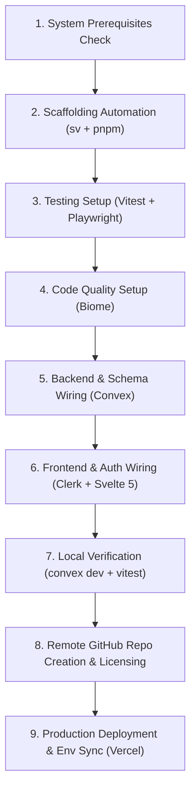

# SvelteKit Full-Stack Pipeline (Convex + Clerk + Biome + Vitest + Playwright + Vercel)

This skill provides an automated, end-to-end recipe for scaffolding, wiring, and deploying a modern full-stack web application. It enforces strict architectural and tooling constraints to guarantee speed, reactivity, code quality, automated testing, and reliable deployments.

## Architecture & Technology Stack

| Layer | Technology | Key Capabilities / Rules |
| :--- | :--- | :--- |
| **Framework & UI** | [SvelteKit](https://svelte.dev) + TypeScript | Modern Svelte 5 runes (`$state`, `$derived`, `$effect`, `Snippet`, `{@render}`), minimal template. |
| **Package Manager** | Strict [`pnpm`](https://pnpm.io) | Fast, space-efficient, deterministic. **NEVER** invoke `npm`, `yarn`, or `bun`. |
| **Code Quality** | [Biome](https://biomejs.dev) (`@biomejs/biome`) | Unified Rust-powered linter and formatter. **STRICTLY NO** ESLint or Prettier. |
| **Testing** | [Vitest](https://vitest.dev) + [Playwright](https://playwright.dev) | Unit, component, and in-memory Convex testing via Vitest; robust E2E testing via Playwright. |
| **Database & Realtime** | [Convex](https://convex.dev) (`convex`, `convex-svelte`) | Real-time reactive queries over WebSocket, TypeScript schema, server functions. |
| **Authentication** | [Clerk](https://clerk.com) (`svelte-clerk`) | Secure auth, JWT session templates, reactive runes, prebuilt UI controls. |
| **VCS & Hosting** | [GitHub CLI](https://cli.github.com) + [Vercel](https://vercel.com) | Automated repository creation (`gh repo create`) and headless zero-config deployments (`vercel --prod`). |

---

## Machine-Readable Reference Endpoints

Prior to execution or when verifying updates, agents can inspect the latest specifications:
- **Clerk Skill**: https://clerk.com/SKILL.md
- **Convex LLM Index**: https://docs.convex.dev/llms.txt
- **Convex Svelte Guide**: https://docs.convex.dev/client/svelte/overview.md
- **Svelte LLM Index**: https://svelte.dev/llms.txt
- **Vercel LLM Index**: https://vercel.com/docs/llms.txt
- **Biome Standards**: https://biomejs.dev/

---

## Execution Workflow



---

### Step 1: System Prerequisites Check

Before modifying or creating any files, verify that the required developer CLI tools are authenticated and available locally:

```bash
# 1. Verify GitHub CLI authentication
gh auth status

# 2. Verify pnpm is installed
pnpm --version

# 3. Verify Vercel CLI is authenticated
npx vercel whoami

# 4. Verify Convex CLI is authenticated
npx convex whoami
```

> [!IMPORTANT]
> If any CLI reports unauthenticated status:
> - For GitHub: Run `gh auth login`
> - For Vercel: Run `npx vercel login`
> - For Convex: Run `npx convex login`
> Do not proceed until all required tools are authenticated.

---

### Step 2: Scaffolding Automation (SvelteKit + Vitest + Playwright)

Initialize a minimal SvelteKit project with TypeScript using Svelte's official CLI (`sv`) via `pnpm dlx`, and install official add-ons for **Vitest** and **Playwright**:

```bash
# 1. Run SvelteKit scaffolding inside the project root
pnpm dlx sv create . --template minimal --types ts --no-add-ons

# 2. Add Vitest and Playwright using official sv add-ons
pnpm dlx sv add vitest="usages:unit,component" playwright --install pnpm

# 3. Install Playwright browser engines
pnpm exec playwright install --with-deps chromium
```

Ensure no legacy configuration files or dependencies were introduced. If any `.eslintrc*`, `.prettier*`, or `eslint*` dependencies exist, remove them immediately:

```bash
# Verify no eslint or prettier dependencies exist
rm -f .eslintrc* .prettier* prettier.config.* eslint.config.*
```

---

### Step 3: Tooling & Code Quality with Biome

Install Biome as a development dependency and configure unified linting and formatting:

```bash
# 1. Install Biome
pnpm add -D @biomejs/biome

# 2. Initialize Biome configuration
pnpm dlx @biomejs/biome init
```

#### Configure `biome.json`

Overwrite `biome.json` with recommended rules tailored for SvelteKit and TypeScript:

```json
{
  "$schema": "https://biomejs.dev/schemas/1.9.4/schema.json",
  "vcs": {
    "enabled": false,
    "clientKind": "git",
    "useIgnoreFile": true
  },
  "files": {
    "ignoreUnknown": false,
    "ignore": [
      ".svelte-kit/**",
      "build/**",
      "dist/**",
      "node_modules/**",
      ".convex/**",
      "src/convex/_generated/**",
      "convex/_generated/**"
    ]
  },
  "formatter": {
    "enabled": true,
    "formatWithErrors": false,
    "indentStyle": "space",
    "indentWidth": 2,
    "lineEnding": "lf",
    "lineWidth": 100
  },
  "javascript": {
    "formatter": {
      "semicolons": "always",
      "quoteStyle": "single",
      "trailingCommas": "all"
    }
  },
  "linter": {
    "enabled": true,
    "rules": {
      "recommended": true,
      "correctness": {
        "noUnusedVariables": "warn"
      },
      "style": {
        "useConst": "error"
      }
    }
  }
}
```

#### Add Scripts to `package.json`

Add the following unified scripts to `package.json`:

```json
"scripts": {
  "dev": "vite dev",
  "build": "vite build",
  "preview": "vite preview",
  "check": "svelte-kit sync && svelte-check --tsconfig ./tsconfig.json && biome check .",
  "lint": "biome lint .",
  "format": "biome format --write .",
  "lint:fix": "biome check --write .",
  "test": "pnpm run test:unit && pnpm run test:e2e",
  "test:unit": "vitest run",
  "test:e2e": "playwright test"
}
```

#### Baseline Test Setup

Ensure baseline test files are in place so continuous testing passes immediately:

- **Unit Test**: `src/demo.test.ts`
  ```ts
  import { describe, expect, it } from 'vitest';

  describe('sanity test', () => {
    it('verifies vitest test runner', () => {
      expect(1 + 1).toBe(2);
    });
  });
  ```

- **E2E Test**: `e2e/demo.test.ts`
  ```ts
  import { expect, test } from '@playwright/test';

  test('homepage renders navigation and auth controls', async ({ page }) => {
    await page.goto('/');
    await expect(page.locator('header')).toBeVisible();
    await expect(page.getByRole('button', { name: /sign in/i })).toBeVisible();
  });
  ```

---

### Step 4: Backend & Database Wiring (Convex)

Install Convex and the reactive Svelte client:

```bash
pnpm add convex convex-svelte svelte-clerk
```

#### 1. Configure Convex Auth: `convex/auth.config.ts`

Create `convex/auth.config.ts` to validate Clerk JWT session tokens against your Clerk Frontend API URL:

```ts
import type { AuthConfig } from 'convex/server';

export default {
  providers: [
    {
      // Matches the Frontend API URL configured in Clerk Dashboard -> Convex Integration
      domain: process.env.CLERK_FRONTEND_API_URL || process.env.CLERK_JWT_ISSUER_DOMAIN!,
      applicationID: 'convex',
    },
  ],
} satisfies AuthConfig;
```

#### 2. Define Data Schema: `convex/schema.ts`

Create `convex/schema.ts` with user-scoped relational tables and indexes:

```ts
import { defineSchema, defineTable } from 'convex/server';
import { v } from 'convex/values';

export default defineSchema({
  tasks: defineTable({
    text: v.string(),
    isCompleted: v.boolean(),
    userId: v.string(),
  }).index('by_user', ['userId']),
});
```

#### 3. Implement Authenticated Functions: `convex/tasks.ts`

Create `convex/tasks.ts` verifying user identity via `ctx.auth.getUserIdentity()`:

```ts
import { v } from 'convex/values';
import { mutation, query } from './_generated/server';

export const list = query({
  args: {},
  handler: async (ctx) => {
    const identity = await ctx.auth.getUserIdentity();
    if (!identity) {
      return [];
    }
    return await ctx.db
      .query('tasks')
      .withIndex('by_user', (q) => q.eq('userId', identity.subject))
      .collect();
  },
});

export const create = mutation({
  args: { text: v.string() },
  handler: async (ctx, args) => {
    const identity = await ctx.auth.getUserIdentity();
    if (!identity) {
      throw new Error('Unauthenticated: Must be logged in to create tasks');
    }
    return await ctx.db.insert('tasks', {
      text: args.text,
      isCompleted: false,
      userId: identity.subject,
    });
  },
});

export const toggle = mutation({
  args: { id: v.id('tasks') },
  handler: async (ctx, args) => {
    const identity = await ctx.auth.getUserIdentity();
    if (!identity) {
      throw new Error('Unauthenticated');
    }
    const task = await ctx.db.get(args.id);
    if (!task || task.userId !== identity.subject) {
      throw new Error('Task not found or unauthorized');
    }
    await ctx.db.patch(args.id, { isCompleted: !task.isCompleted });
  },
});
```

---

### Step 5: Authentication & Frontend Wiring (Clerk + Convex + Svelte 5)

#### 1. Server Handler: `src/hooks.server.ts`

Create `src/hooks.server.ts` using `svelte-clerk/server` to handle sessions on incoming requests:

```ts
import { withClerkHandler } from 'svelte-clerk/server';

export const handle = withClerkHandler();
```

#### 2. Environment Types: `src/app.d.ts`

Update `src/app.d.ts` to include Clerk environment types:

```ts
/// <reference types="svelte-clerk/env" />

declare global {
  namespace App {
    // interface Error {}
    // interface Locals {}
    // interface PageData {}
    // interface PageState {}
    // interface Platform {}
  }
}

export {};
```

#### 3. Server Loader for SSR: `src/routes/+layout.server.ts`

Pass initial authentication state to the client layout for instant hydration:

```ts
import { buildClerkProps } from 'svelte-clerk/server';
import type { LayoutServerLoad } from './$types';

export const load: LayoutServerLoad = ({ locals }) => {
  return {
    ...buildClerkProps(locals.auth()),
  };
};
```

#### 4. Root Layout with Realtime Auth Synchronization: `src/routes/+layout.svelte`

Initialize Convex and pass Clerk session tokens to Convex reactively inside Svelte 5 `$effect`:

```svelte
<script lang="ts">
  import type { Snippet } from 'svelte';
  import { ClerkProvider, SignedIn, SignedOut, SignInButton, UserButton } from 'svelte-clerk';
  import { useClerkContext } from 'svelte-clerk/client';
  import { setupConvex } from 'convex-svelte';
  import { PUBLIC_CONVEX_URL } from '$env/static/public';

  const { children }: { children: Snippet } = $props();

  // 1. Initialize Convex client
  const client = setupConvex(PUBLIC_CONVEX_URL);

  // 2. Synchronize Clerk session token with Convex
  const ctx = useClerkContext();

  $effect(() => {
    client.setAuth(async () => {
      try {
        if (!ctx.session) return null;
        return (await ctx.session.getToken({ template: 'convex' })) ?? null;
      } catch {
        return null;
      }
    });
  });
</script>

<ClerkProvider>
  <div class="app-layout">
    <header class="app-header">
      <div class="brand">
        <span class="logo">⚡</span>
        <strong>SvelteKit + Convex</strong>
      </div>
      <nav class="auth-nav">
        <SignedOut>
          <SignInButton mode="modal" class="btn-signin">Sign In</SignInButton>
        </SignedOut>
        <SignedIn>
          <UserButton afterSignOutUrl="/" />
        </SignedIn>
      </nav>
    </header>

    <main class="app-main">
      {@render children?.()}
    </main>
  </div>
</ClerkProvider>

<style>
  :global(body) {
    margin: 0;
    font-family: -apple-system, BlinkMacSystemFont, 'Segoe UI', Roboto, Oxygen, Ubuntu, Cantarell, sans-serif;
    color: #1f2937;
    background-color: #f9fafb;
  }
  .app-layout {
    min-height: 100vh;
    display: flex;
    flex-direction: column;
  }
  .app-header {
    display: flex;
    justify-content: space-between;
    align-items: center;
    padding: 1rem 2rem;
    background: #ffffff;
    border-bottom: 1px solid #e5e7eb;
  }
  .brand {
    display: flex;
    align-items: center;
    gap: 0.5rem;
    font-size: 1.125rem;
  }
  .auth-nav {
    display: flex;
    align-items: center;
    gap: 1rem;
  }
  :global(.btn-signin) {
    background-color: #2563eb;
    color: #ffffff;
    padding: 0.5rem 1rem;
    border-radius: 0.375rem;
    border: none;
    font-weight: 500;
    cursor: pointer;
  }
  .app-main {
    flex: 1;
    max-width: 900px;
    width: 100%;
    margin: 2rem auto;
    padding: 0 1rem;
    box-sizing: border-box;
  }
</style>
```

#### 5. Sample Protected Reactive View: `src/routes/+page.svelte`

```svelte
<script lang="ts">
  import { useQuery, useMutation } from 'convex-svelte';
  import { api } from '$convex/_generated/api';
  import { SignedIn, SignedOut, SignInButton } from 'svelte-clerk';

  const tasks = useQuery(api.tasks.list, {});
  const createTask = useMutation(api.tasks.create);
  const toggleTask = useMutation(api.tasks.toggle);

  let newTaskText = $state('');
  let isSubmitting = $state(false);

  async function handleSubmit(event: SubmitEvent) {
    event.preventDefault();
    const text = newTaskText.trim();
    if (!text || isSubmitting) return;

    isSubmitting = true;
    try {
      await createTask({ text });
      newTaskText = '';
    } finally {
      isSubmitting = false;
    }
  }
</script>

<SignedOut>
  <div class="hero-card">
    <h1>Welcome to Full-Stack SvelteKit</h1>
    <p>Sign in above to test authenticated real-time database queries powered by Convex and Clerk.</p>
    <SignInButton mode="modal" class="btn-signin">Get Started</SignInButton>
  </div>
</SignedOut>

<SignedIn>
  <section class="dashboard">
    <h2>Your Real-Time Tasks</h2>
    <form onsubmit={handleSubmit} class="task-form">
      <input
        type="text"
        bind:value={newTaskText}
        placeholder="What needs doing?"
        disabled={isSubmitting}
        class="task-input"
      />
      <button type="submit" disabled={isSubmitting || !newTaskText.trim()} class="btn-submit">
        {isSubmitting ? 'Adding...' : 'Add Task'}
      </button>
    </form>

    {#if $tasks.isLoading}
      <p>Loading tasks from Convex...</p>
    {:else if $tasks.error}
      <p class="error">Error: {$tasks.error.toString()}</p>
    {:else if $tasks.data?.length === 0}
      <p>No tasks yet. Create one above!</p>
    {:else}
      <ul class="task-list">
        {#each $tasks.data ?? [] as task (task._id)}
          <li class="task-item">
            <label>
              <input
                type="checkbox"
                checked={task.isCompleted}
                onchange={() => toggleTask({ id: task._id })}
              />
              <span class:completed={task.isCompleted}>{task.text}</span>
            </label>
          </li>
        {/each}
      </ul>
    {/if}
  </section>
</SignedIn>

<style>
  .hero-card, .dashboard {
    background: #ffffff;
    padding: 2rem;
    border-radius: 0.5rem;
    box-shadow: 0 1px 3px rgba(0, 0, 0, 0.1);
  }
  .task-form {
    display: flex;
    gap: 0.5rem;
    margin-bottom: 1.5rem;
  }
  .task-input {
    flex: 1;
    padding: 0.5rem 0.75rem;
    border: 1px solid #d1d5db;
    border-radius: 0.375rem;
  }
  .btn-submit {
    padding: 0.5rem 1rem;
    background: #2563eb;
    color: white;
    border: none;
    border-radius: 0.375rem;
    cursor: pointer;
  }
  .task-list {
    list-style: none;
    padding: 0;
  }
  .task-item {
    padding: 0.5rem 0;
    border-bottom: 1px solid #f3f4f6;
  }
  .completed {
    text-decoration: line-through;
    color: #9ca3af;
  }
</style>
```

---

### Step 6: Environment & Headless Backend Provisioning

1. **Provision Convex Dev Backend Headlessly**:
   ```bash
   npx convex dev --once
   ```
   This generates the deployment URL and updates `.env.local` with `CONVEX_DEPLOYMENT` and `PUBLIC_CONVEX_URL`.

2. **Configure Clerk JWT Template on Convex**:
   In the Clerk Dashboard, navigate to **JWT Templates**, choose **New Template** -> **Convex**, and copy your **Frontend API URL** (format: `https://verb-noun-00.clerk.accounts.dev`).
   Then set it on your Convex deployment:
   ```bash
   npx convex env set CLERK_FRONTEND_API_URL https://<your-fapi-url>.clerk.accounts.dev
   ```

3. **Verify Code Quality & Unit Tests**:
   ```bash
   pnpm run lint
   pnpm run format
   pnpm run test:unit
   ```

---

### Step 7: Remote GitHub Repository Creation & Licensing

Every new application scaffolded by this skill must have its remote GitHub repository provisioned and pushed using the GitHub CLI (`gh`).

#### 1. Inquire Repository Visibility & Apply License
Before creating the repository, ask the user whether the repository should be **public** or **private**:

- **If Public**:
  The project **MUST** include an MIT license.
  Generate `LICENSE` with the current year and the author/organization name (retrieved via `gh api user -q .name` or `git config user.name`):

  ```bash
  YEAR=$(date +%Y)
  AUTHOR=$(gh api user -q '.name // .login' 2>/dev/null || git config user.name || echo "The Author")
  cat << EOF > LICENSE
  MIT License

  Copyright (c) $YEAR $AUTHOR

  Permission is hereby granted, free of charge, to any person obtaining a copy
  of this software and associated documentation files (the "Software"), to deal
  in the Software without restriction, including without limitation the rights
  to use, copy, modify, merge, publish, distribute, sublicense, and/or sell
  copies of the Software, and to permit persons to whom the Software is
  furnished to do so, subject to the following conditions:

  The above copyright notice and this permission notice shall be included in all
  copies or substantial portions of the Software.

  THE SOFTWARE IS PROVIDED "AS IS", WITHOUT WARRANTY OF ANY KIND, EXPRESS OR
  IMPLIED, INCLUDING BUT NOT LIMITED TO THE WARRANTIES OF MERCHANTABILITY,
  FITNESS FOR A PARTICULAR PURPOSE AND NONINFRINGEMENT. IN NO EVENT SHALL THE
  AUTHORS OR COPYRIGHT HOLDERS BE LIABLE FOR ANY CLAIM, DAMAGES OR OTHER
  LIABILITY, WHETHER IN AN ACTION OF CONTRACT, TORT OR OTHERWISE, ARISING FROM,
  OUT OF OR IN CONNECTION WITH THE SOFTWARE OR THE USE OR OTHER DEALINGS IN THE
  SOFTWARE.
  EOF
  ```

- **If Private**:
  No public open-source license is required unless requested.

#### 2. Initialize Git and Commit
```bash
# 1. Initialize git if not already present
git init -b main

# 2. Stage and commit all baseline files and license
git add -A
git commit -m "feat: initial scaffold with sveltekit, convex, clerk, and biome"
```

#### 3. Provision Remote Repository on GitHub
```bash
# For Public:
gh repo create <repo-name> --public --source=. --push

# For Private:
gh repo create <repo-name> --private --source=. --push
```

Verify that the remote tracking branch is established:
```bash
gh repo view
```

---

### Step 8: Headless Vercel Deployment & Environment Variable Sync

1. **Pre-Deployment Verification Gate (Lints & Tests)**:
   Always verify lints, typechecks, and tests pass before initiating deployment:
   ```bash
   pnpm run check
   pnpm run test:unit
   pnpm run test:e2e
   ```

2. **Deploy Headlessly to Vercel**:
   ```bash
   npx vercel --prod --yes
   ```

3. **Synchronize Production Environment Variables on Vercel**:
   Set the exact required production environment variables using the Vercel CLI:
   ```bash
   # Add Public Convex URL
   npx vercel env add PUBLIC_CONVEX_URL production

   # Add Public Clerk Publishable Key
   npx vercel env add PUBLIC_CLERK_PUBLISHABLE_KEY production

   # Add Clerk Secret Key
   npx vercel env add CLERK_SECRET_KEY production
   ```

4. **Trigger Final Production Build**:
   ```bash
   npx vercel --prod --yes
   ```

---

## Completion Verification Checklist

- [ ] `pnpm --version` confirmed `pnpm` is strictly used (no `npm` or `yarn` lockfiles created).
- [ ] No `eslint` or `prettier` packages or configuration files exist in the project root.
- [ ] `biome.json` is configured and `pnpm run check` passes without warnings or formatting errors.
- [ ] Vitest unit tests and Playwright E2E tests are configured and pass (`pnpm run test`).
- [ ] `convex/auth.config.ts` matches Clerk's Frontend API URL.
- [ ] `src/routes/+layout.svelte` establishes reactive token passing from `useClerkContext()` to `setupConvex()`.
- [ ] Remote GitHub repository created via `gh repo create` (with MIT license if public).
- [ ] Project successfully deployed to Vercel with production environment variables verified.

