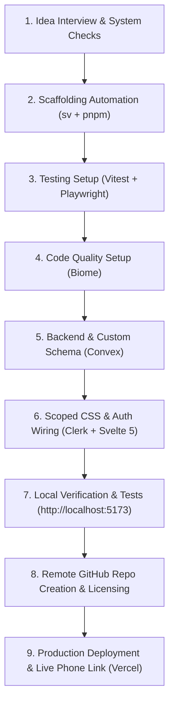

# SvelteKit Full-Stack Pipeline (Convex + Clerk + Biome + Vitest + Playwright + Vercel)

This skill provides an automated, end-to-end recipe for scaffolding, wiring, and deploying a modern full-stack web application. It enforces strict architectural and tooling constraints to guarantee speed, reactivity, code quality, automated testing, and reliable deployments.

## Architecture & Technology Stack

| Layer | Technology | Key Capabilities / Rules |
| :--- | :--- | :--- |
| **Framework & UI** | [SvelteKit](https://svelte.dev) + TypeScript | Modern Svelte 5 runes (`$state`, `$derived`, `$effect`, `Snippet`, `{@render}`), minimal template. |
| **Styling** | Standard Scoped CSS + CSS Variables (`src/app.css`) | **STRICTLY NO TAILWIND**. Clean, zero-dependency design system, dark mode, mobile-ready. |
| **Package Manager** | Strict [`pnpm`](https://pnpm.io) | Fast, space-efficient, deterministic. **NEVER** invoke `npm`, `yarn`, or `bun`. |
| **Code Quality** | [Biome](https://biomejs.dev) (`@biomejs/biome`) | Unified Rust-powered linter and formatter. **STRICTLY NO** ESLint or Prettier. |
| **Testing** | [Vitest](https://vitest.dev) + [Playwright](https://playwright.dev) | Unit, component, and in-memory Convex testing via Vitest; robust E2E testing via Playwright. |
| **Database & Realtime** | [Convex](https://convex.dev) (`convex`, `convex-svelte`) | Real-time reactive queries over WebSocket, TypeScript schema, server functions. |
| **Authentication** | [Clerk](https://clerk.com) (`svelte-clerk`) | Secure auth, JWT session templates, reactive runes, prebuilt UI controls. |
| **VCS & Hosting** | [GitHub CLI](https://cli.github.com) + [Vercel](https://vercel.com) | Automated repository creation (`gh repo create`) and headless zero-config deployments (`vercel --prod`). |

---

## Non-SWE Friendly Principles & Agent Communication

When executing this skill for non-software engineers, solo creators, or beginners, you MUST adhere to these conversational rules:

1. **Zero Jargon & No Raw Stack Traces**:
   - **Never** paste raw compiler errors, TypeScript codes (e.g. `TS2322`), or stack traces into the chat.
   - Fix issues silently and autonomously. If user input is needed, speak in plain, reassuring English (*"I noticed a small layout alignment issue while testing your page, and I'm updating it now."*).
2. **Interactive Idea-to-App Modeling**:
   - Do **NOT** assume the user only wants a generic todo list.
   - Ask them in plain English what their app is about, and automatically customize the Convex schema, mutations, queries, and Svelte UI for their specific idea (recipes, book logs, trip planners, habits, etc.).
3. **Click-by-Click Guidance for Keys**:
   - Guide the user step-by-step with direct clickable links when setting up Clerk and Convex. Never use terms like "JWT issuer domain" without explaining where to click.
4. **Milestone Celebrations & Clickable Links**:
   - Always present a clickable local preview link: `http://localhost:5173`.
   - Always present the live mobile-friendly Vercel production link: `https://<app>.vercel.app` with instructions on how to test logging in on their phone.

---

## Machine-Readable Reference Endpoints

Prior to execution or when verifying updates, agents can inspect the latest specifications:
- **Clerk Skill**: https://clerk.com/SKILL.md
- **Convex LLM Index**: https://docs.convex.dev/llms.txt
- **Convex Svelte Guide**: https://docs.convex.dev/client/svelte/overview.md
- **Svelte LLM Index**: https://svelte.dev/llms.txt
- **Vercel LLM Index**: https://vercel.com/docs/llms.txt
- **Biome Standards**: https://biomejs.dev/

---

## Execution Workflow



---

### Step 1: System Prerequisites & Idea Discovery

#### 1. Verify Developer CLI States
Before creating any files, verify that local developer CLI tools are authenticated and available:

```bash
# 1. Verify GitHub CLI authentication
gh auth status

# 2. Verify pnpm is installed
pnpm --version

# 3. Verify Vercel CLI is authenticated
npx vercel whoami

# 4. Verify Convex CLI is authenticated
npx convex whoami
```

> [!IMPORTANT]
> If any tool reports unauthenticated status, assist the user calmly:
> - For GitHub: Run `gh auth login`
> - For Vercel: Run `npx vercel login`
> - For Convex: Run `npx convex login`

#### 2. The Idea Interview (For Non-SWEs & Creators)
Ask the user in plain English what they would like to build:
> *"What kind of app would you like to build today, and what kinds of things do you want people to save, view, or track?"*

Common examples to inspire them:
- **Recipe Box**: Save family recipes, ingredients, and cooking times.
- **Reading Journal**: Track books, ratings, favorites, and notes.
- **Habit or Workout Tracker**: Daily logs, checklists, and streaks.
- **Trip Planner**: Itineraries, packing lists, and locations.

**Agent Action**: Take their plain-English description and design the Convex schema, mutations, queries, and Svelte UI for *their specific idea* rather than just a generic todo list!

---

### Step 2: Scaffolding Automation (SvelteKit + Vitest + Playwright)

Initialize a minimal SvelteKit project with TypeScript using Svelte's official CLI (`sv`) via `pnpm dlx`, and install official add-ons for **Vitest** and **Playwright**:

```bash
# 1. Run SvelteKit scaffolding inside the project root
pnpm dlx sv create . --template minimal --types ts --no-add-ons

# 2. Add Vitest and Playwright using official sv add-ons
pnpm dlx sv add vitest="usages:unit,component" playwright --install pnpm

# 3. Install Playwright browser engines
pnpm exec playwright install --with-deps chromium
```

Ensure no legacy configuration files or dependencies were introduced. If any `.eslintrc*`, `.prettier*`, or `eslint*` dependencies exist, remove them immediately:

```bash
# Verify no eslint or prettier dependencies exist
rm -f .eslintrc* .prettier* prettier.config.* eslint.config.*
```

---

### Step 3: Tooling & Code Quality with Biome

Install Biome as a development dependency and configure unified linting and formatting:

```bash
# 1. Install Biome
pnpm add -D @biomejs/biome

# 2. Initialize Biome configuration
pnpm dlx @biomejs/biome init
```

#### Configure `biome.json`

Overwrite `biome.json` with recommended rules tailored for SvelteKit and TypeScript:

```json
{
  "$schema": "https://biomejs.dev/schemas/1.9.4/schema.json",
  "vcs": {
    "enabled": false,
    "clientKind": "git",
    "useIgnoreFile": true
  },
  "files": {
    "ignoreUnknown": false,
    "ignore": [
      ".svelte-kit/**",
      "build/**",
      "dist/**",
      "node_modules/**",
      ".convex/**",
      "src/convex/_generated/**",
      "convex/_generated/**"
    ]
  },
  "formatter": {
    "enabled": true,
    "formatWithErrors": false,
    "indentStyle": "space",
    "indentWidth": 2,
    "lineEnding": "lf",
    "lineWidth": 100
  },
  "javascript": {
    "formatter": {
      "semicolons": "always",
      "quoteStyle": "single",
      "trailingCommas": "all"
    }
  },
  "linter": {
    "enabled": true,
    "rules": {
      "recommended": true,
      "correctness": {
        "noUnusedVariables": "warn"
      },
      "style": {
        "useConst": "error"
      }
    }
  }
}
```

#### Add Scripts to `package.json`

Add the following unified scripts to `package.json`:

```json
"scripts": {
  "dev": "vite dev",
  "build": "vite build",
  "preview": "vite preview",
  "check": "svelte-kit sync && svelte-check --tsconfig ./tsconfig.json && biome check .",
  "lint": "biome lint .",
  "format": "biome format --write .",
  "lint:fix": "biome check --write .",
  "test": "pnpm run test:unit && pnpm run test:e2e",
  "test:unit": "vitest run",
  "test:e2e": "playwright test"
}
```

#### Baseline Test Setup

Ensure baseline test files are in place so continuous testing passes immediately:

- **Unit Test**: `src/demo.test.ts`
  ```ts
  import { describe, expect, it } from 'vitest';

  describe('sanity test', () => {
    it('verifies vitest test runner', () => {
      expect(1 + 1).toBe(2);
    });
  });
  ```

- **E2E Test**: `e2e/demo.test.ts`
  ```ts
  import { expect, test } from '@playwright/test';

  test('homepage renders navigation and auth controls', async ({ page }) => {
    await page.goto('/');
    await expect(page.locator('header')).toBeVisible();
    await expect(page.getByRole('button', { name: /sign in/i })).toBeVisible();
  });
  ```

---

### Step 4: Backend & Database Wiring (Convex)

Install Convex and the reactive Svelte client:

```bash
pnpm add convex convex-svelte svelte-clerk
```

#### 1. Configure Convex Auth: `convex/auth.config.ts`

Create `convex/auth.config.ts` to validate Clerk JWT session tokens against your Clerk Frontend API URL:

```ts
import type { AuthConfig } from 'convex/server';

export default {
  providers: [
    {
      // Matches the Frontend API URL configured in Clerk Dashboard -> Convex Integration
      domain: process.env.CLERK_FRONTEND_API_URL || process.env.CLERK_JWT_ISSUER_DOMAIN!,
      applicationID: 'convex',
    },
  ],
} satisfies AuthConfig;
```

#### 2. Define Data Schema: `convex/schema.ts`

Create `convex/schema.ts` with user-scoped relational tables and indexes:

```ts
import { defineSchema, defineTable } from 'convex/server';
import { v } from 'convex/values';

export default defineSchema({
  tasks: defineTable({
    text: v.string(),
    isCompleted: v.boolean(),
    userId: v.string(),
  }).index('by_user', ['userId']),
});
```

#### 3. Implement Authenticated Functions: `convex/tasks.ts`

Create `convex/tasks.ts` verifying user identity via `ctx.auth.getUserIdentity()`:

```ts
import { v } from 'convex/values';
import { mutation, query } from './_generated/server';

export const list = query({
  args: {},
  handler: async (ctx) => {
    const identity = await ctx.auth.getUserIdentity();
    if (!identity) {
      return [];
    }
    return await ctx.db
      .query('tasks')
      .withIndex('by_user', (q) => q.eq('userId', identity.subject))
      .collect();
  },
});

export const create = mutation({
  args: { text: v.string() },
  handler: async (ctx, args) => {
    const identity = await ctx.auth.getUserIdentity();
    if (!identity) {
      throw new Error('Unauthenticated: Must be logged in to create tasks');
    }
    return await ctx.db.insert('tasks', {
      text: args.text,
      isCompleted: false,
      userId: identity.subject,
    });
  },
});

export const toggle = mutation({
  args: { id: v.id('tasks') },
  handler: async (ctx, args) => {
    const identity = await ctx.auth.getUserIdentity();
    if (!identity) {
      throw new Error('Unauthenticated');
    }
    const task = await ctx.db.get(args.id);
    if (!task || task.userId !== identity.subject) {
      throw new Error('Task not found or unauthorized');
    }
    await ctx.db.patch(args.id, { isCompleted: !task.isCompleted });
  },
});
```

---

### Step 5: Authentication & Frontend Wiring (Clerk + Convex + Svelte 5)

#### 1. Server Handler: `src/hooks.server.ts`

Create `src/hooks.server.ts` using `svelte-clerk/server` to handle sessions on incoming requests:

```ts
import { withClerkHandler } from 'svelte-clerk/server';

export const handle = withClerkHandler();
```

#### 2. Environment Types: `src/app.d.ts`

Update `src/app.d.ts` to include Clerk environment types:

```ts
/// <reference types="svelte-clerk/env" />

declare global {
  namespace App {
    // interface Error {}
    // interface Locals {}
    // interface PageData {}
    // interface PageState {}
    // interface Platform {}
  }
}

export {};
```

#### 3. Server Loader for SSR: `src/routes/+layout.server.ts`

Pass initial authentication state to the client layout for instant hydration:

```ts
import { buildClerkProps } from 'svelte-clerk/server';
import type { LayoutServerLoad } from './$types';

export const load: LayoutServerLoad = ({ locals }) => {
  return {
    ...buildClerkProps(locals.auth()),
  };
};
```

#### 4. Zero-Dependency CSS Design System: `src/app.css`

Create `src/app.css` providing a clean, modern design system using native CSS variables without Tailwind or external dependencies:

```css
/* Zero-dependency, modern CSS design system for SvelteKit */
:root {
  --font-sans: -apple-system, BlinkMacSystemFont, 'Segoe UI', Roboto, Helvetica, Arial, sans-serif;
  --font-mono: ui-monospace, SFMono-Regular, Menlo, Monaco, Consolas, monospace;

  --color-primary: #2563eb;
  --color-primary-hover: #1d4ed8;
  --color-primary-light: #eff6ff;

  --color-bg: #f8fafc;
  --color-surface: #ffffff;
  --color-border: #e2e8f0;

  --color-text: #0f172a;
  --color-text-muted: #64748b;
  --color-text-inverse: #ffffff;

  --color-success: #16a34a;
  --color-error: #dc2626;
  --color-error-bg: #fef2f2;

  --radius-sm: 0.375rem;
  --radius-md: 0.5rem;
  --radius-lg: 0.75rem;

  --shadow-sm: 0 1px 2px 0 rgb(0 0 0 / 0.05);
  --shadow-md: 0 4px 6px -1px rgb(0 0 0 / 0.1), 0 2px 4px -2px rgb(0 0 0 / 0.1);

  --transition-fast: 0.15s ease;
}

@media (prefers-color-scheme: dark) {
  :root {
    --color-bg: #0b0f19;
    --color-surface: #151d2f;
    --color-border: #1e293b;

    --color-text: #f8fafc;
    --color-text-muted: #94a3b8;

    --color-primary: #3b82f6;
    --color-primary-hover: #60a5fa;
    --color-primary-light: #1e293b;

    --color-error-bg: #450a0a;
  }
}

*, *::before, *::after {
  box-sizing: border-box;
}

body {
  margin: 0;
  font-family: var(--font-sans);
  background-color: var(--color-bg);
  color: var(--color-text);
  line-height: 1.5;
  -webkit-font-smoothing: antialiased;
}

.container {
  width: 100%;
  max-width: 860px;
  margin: 0 auto;
  padding: 1.5rem 1rem;
}

.card {
  background: var(--color-surface);
  border: 1px solid var(--color-border);
  border-radius: var(--radius-lg);
  padding: 1.75rem;
  box-shadow: var(--shadow-sm);
  margin-bottom: 1.5rem;
}

.btn {
  display: inline-flex;
  align-items: center;
  justify-content: center;
  gap: 0.5rem;
  font-weight: 500;
  font-size: 0.95rem;
  padding: 0.625rem 1.25rem;
  border-radius: var(--radius-md);
  border: 1px solid transparent;
  cursor: pointer;
  transition: all var(--transition-fast);
  text-decoration: none;
}

.btn:disabled {
  opacity: 0.6;
  cursor: not-allowed;
}

.btn-primary {
  background-color: var(--color-primary);
  color: var(--color-text-inverse);
}

.btn-primary:hover:not(:disabled) {
  background-color: var(--color-primary-hover);
}

.input {
  width: 100%;
  padding: 0.625rem 0.875rem;
  font-size: 0.95rem;
  background-color: var(--color-surface);
  color: var(--color-text);
  border: 1px solid var(--color-border);
  border-radius: var(--radius-md);
  outline: none;
  transition: border-color var(--transition-fast);
}

.input:focus {
  border-color: var(--color-primary);
  box-shadow: 0 0 0 2px var(--color-primary-light);
}

.badge {
  display: inline-block;
  font-size: 0.75rem;
  font-weight: 600;
  padding: 0.2rem 0.5rem;
  border-radius: 9999px;
  background-color: var(--color-primary-light);
  color: var(--color-primary);
}
```

#### 5. Root Layout: `src/routes/+layout.svelte`

Initialize Convex, import `../app.css`, and pass Clerk session tokens to Convex reactively:

```svelte
<script lang="ts">
  import '../app.css';
  import type { Snippet } from 'svelte';
  import { ClerkProvider, SignedIn, SignedOut, SignInButton, UserButton } from 'svelte-clerk';
  import { useClerkContext } from 'svelte-clerk/client';
  import { setupConvex } from 'convex-svelte';
  import { PUBLIC_CONVEX_URL } from '$env/static/public';

  const { children }: { children: Snippet } = $props();

  const client = setupConvex(PUBLIC_CONVEX_URL);
  const ctx = useClerkContext();

  $effect(() => {
    client.setAuth(async () => {
      try {
        if (!ctx.session) return null;
        return (await ctx.session.getToken({ template: 'convex' })) ?? null;
      } catch {
        return null;
      }
    });
  });
</script>

<ClerkProvider>
  <div class="app-shell">
    <header class="navbar">
      <div class="nav-content">
        <a href="/" class="brand-link">
          <span class="brand-icon">⚡</span>
          <span class="brand-title">My App</span>
        </a>
        <nav class="auth-controls">
          <SignedOut>
            <SignInButton mode="modal" class="btn btn-primary">Sign In</SignInButton>
          </SignedOut>
          <SignedIn>
            <UserButton afterSignOutUrl="/" />
          </SignedIn>
        </nav>
      </div>
    </header>

    <main class="container">
      {@render children?.()}
    </main>

    <footer class="app-footer">
      <p>Built with SvelteKit & Convex</p>
    </footer>
  </div>
</ClerkProvider>

<style>
  .app-shell {
    min-height: 100vh;
    display: flex;
    flex-direction: column;
  }
  .navbar {
    background: var(--color-surface);
    border-bottom: 1px solid var(--color-border);
    position: sticky;
    top: 0;
    z-index: 10;
  }
  .nav-content {
    max-width: 860px;
    margin: 0 auto;
    padding: 0.875rem 1rem;
    display: flex;
    justify-content: space-between;
    align-items: center;
  }
  .brand-link {
    display: flex;
    align-items: center;
    gap: 0.5rem;
    text-decoration: none;
    color: var(--color-text);
    font-weight: 700;
    font-size: 1.125rem;
  }
  .brand-icon {
    font-size: 1.25rem;
  }
  .auth-controls {
    display: flex;
    align-items: center;
    gap: 0.75rem;
  }
  .app-footer {
    margin-top: auto;
    text-align: center;
    padding: 2rem 1rem;
    color: var(--color-text-muted);
    font-size: 0.875rem;
    border-top: 1px solid var(--color-border);
  }
</style>
```

#### 6. Custom Reactive View: `src/routes/+page.svelte`

Tailor this page to the user's specific idea (e.g. recipes, journals, tasks) using scoped Svelte styles:

```svelte
<script lang="ts">
  import { useQuery, useMutation } from 'convex-svelte';
  import { api } from '$convex/_generated/api';
  import { SignedIn, SignedOut, SignInButton } from 'svelte-clerk';

  const tasks = useQuery(api.tasks.list, {});
  const createTask = useMutation(api.tasks.create);
  const toggleTask = useMutation(api.tasks.toggle);

  let newTaskText = $state('');
  let isSubmitting = $state(false);

  async function handleSubmit(event: SubmitEvent) {
    event.preventDefault();
    const text = newTaskText.trim();
    if (!text || isSubmitting) return;

    isSubmitting = true;
    try {
      await createTask({ text });
      newTaskText = '';
    } finally {
      isSubmitting = false;
    }
  }
</script>

<SignedOut>
  <div class="card hero-card">
    <h1>Welcome to Your App</h1>
    <p>Sign in to start creating and saving your items in real time.</p>
    <SignInButton mode="modal" class="btn btn-primary">Sign In to Get Started</SignInButton>
  </div>
</SignedOut>

<SignedIn>
  <section class="card">
    <div class="card-header">
      <h2>Your Saved Items</h2>
      <span class="badge">Live Sync</span>
    </div>
    <p class="card-subtitle">Anything you add updates instantly across your phone and computer.</p>

    <form onsubmit={handleSubmit} class="add-form">
      <input
        type="text"
        bind:value={newTaskText}
        placeholder="Add a new item..."
        disabled={isSubmitting}
        class="input"
      />
      <button type="submit" disabled={isSubmitting || !newTaskText.trim()} class="btn btn-primary">
        {isSubmitting ? 'Adding...' : 'Add'}
      </button>
    </form>

    {#if $tasks.isLoading}
      <div class="state-message">
        <p>Loading your items...</p>
      </div>
    {:else if $tasks.error}
      <div class="state-message error">
        <p>Could not load items: {$tasks.error.toString()}</p>
      </div>
    {:else if $tasks.data?.length === 0}
      <div class="state-message">
        <p>No items yet. Type something above and click Add!</p>
      </div>
    {:else}
      <ul class="item-list">
        {#each $tasks.data ?? [] as task (task._id)}
          <li class="item-row">
            <label class="item-label">
              <input
                type="checkbox"
                checked={task.isCompleted}
                onchange={() => toggleTask({ id: task._id })}
                class="checkbox"
              />
              <span class="item-title" class:completed={task.isCompleted}>
                {task.text}
              </span>
            </label>
          </li>
        {/each}
      </ul>
    {/if}
  </section>
</SignedIn>

<style>
  .hero-card {
    text-align: center;
    padding: 3rem 1.5rem;
  }
  .hero-card h1 {
    margin-top: 0;
    font-size: 2rem;
  }
  .hero-card p {
    color: var(--color-text-muted);
    font-size: 1.1rem;
    margin-bottom: 2rem;
  }
  .card-header {
    display: flex;
    justify-content: space-between;
    align-items: center;
    margin-bottom: 0.25rem;
  }
  .card-header h2 {
    margin: 0;
  }
  .card-subtitle {
    margin-top: 0;
    margin-bottom: 1.5rem;
    color: var(--color-text-muted);
    font-size: 0.9rem;
  }
  .add-form {
    display: flex;
    gap: 0.5rem;
    margin-bottom: 1.5rem;
  }
  .item-list {
    list-style: none;
    padding: 0;
    margin: 0;
  }
  .item-row {
    padding: 0.875rem 0.5rem;
    border-bottom: 1px solid var(--color-border);
  }
  .item-row:last-child {
    border-bottom: none;
  }
  .item-label {
    display: flex;
    align-items: center;
    gap: 0.75rem;
    cursor: pointer;
  }
  .checkbox {
    width: 1.25rem;
    height: 1.25rem;
    accent-color: var(--color-primary);
  }
  .item-title {
    font-size: 1rem;
    color: var(--color-text);
  }
  .completed {
    text-decoration: line-through;
    color: var(--color-text-muted);
  }
  .state-message {
    padding: 2rem;
    text-align: center;
    color: var(--color-text-muted);
    background: var(--color-bg);
    border-radius: var(--radius-md);
  }
  .state-message.error {
    color: var(--color-error);
    background: var(--color-error-bg);
  }
</style>
```

---

### Step 6: Backend Provisioning & Click-by-Click Auth Setup

#### 1. Provision Convex Dev Backend Headlessly
Run headless Convex provisioning:
```bash
npx convex dev --once
```
This generates the deployment URL and updates `.env.local` with `CONVEX_DEPLOYMENT` and `PUBLIC_CONVEX_URL`.

#### 2. Click-by-Click Guide for Clerk Setup (For Non-SWEs)
Guide the user with clear, friendly steps to obtain their keys:

> 1. Open [https://dashboard.clerk.com](https://dashboard.clerk.com) in your browser.
> 2. Click **Add application** (or **Create application**), enter your app's name, and pick how users can sign in (e.g. Google, Email).
> 3. Click **Create Application**.
> 4. In the **API Keys** section, copy the **Publishable Key** (starts with `pk_test_...`) and the **Secret Key** (starts with `sk_test_...`).
> 5. On the left sidebar in Clerk, click **JWT Templates** $\to$ **New Template** $\to$ click **Convex**.
> 6. Copy the **Frontend API URL** (it looks like `https://verb-noun-00.clerk.accounts.dev`).

Once the user provides the Frontend API URL, configure it on Convex:
```bash
npx convex env set CLERK_FRONTEND_API_URL <user-fapi-url>
```

#### 3. Verify Code Quality & Unit Tests
```bash
pnpm run lint
pnpm run format
pnpm run test:unit
```

---

### Step 7: Remote GitHub Repository Creation & Licensing

Every new application scaffolded by this skill must have its remote GitHub repository provisioned and pushed using the GitHub CLI (`gh`).

#### 1. Inquire Repository Visibility & Apply License
Before creating the repository, ask the user whether the repository should be **public** or **private**:

- **If Public**:
  The project **MUST** include an MIT license.
  Generate `LICENSE` with the current year and the author/organization name (retrieved via `gh api user -q .name` or `git config user.name`):

  ```bash
  YEAR=$(date +%Y)
  AUTHOR=$(gh api user -q '.name // .login' 2>/dev/null || git config user.name || echo "The Author")
  cat << EOF > LICENSE
  MIT License

  Copyright (c) $YEAR $AUTHOR

  Permission is hereby granted, free of charge, to any person obtaining a copy
  of this software and associated documentation files (the "Software"), to deal
  in the Software without restriction, including without limitation the rights
  to use, copy, modify, merge, publish, distribute, sublicense, and/or sell
  copies of the Software, and to permit persons to whom the Software is
  furnished to do so, subject to the following conditions:

  The above copyright notice and this permission notice shall be included in all
  copies or substantial portions of the Software.

  THE SOFTWARE IS PROVIDED "AS IS", WITHOUT WARRANTY OF ANY KIND, EXPRESS OR
  IMPLIED, INCLUDING BUT NOT LIMITED TO THE WARRANTIES OF MERCHANTABILITY,
  FITNESS FOR A PARTICULAR PURPOSE AND NONINFRINGEMENT. IN NO EVENT SHALL THE
  AUTHORS OR COPYRIGHT HOLDERS BE LIABLE FOR ANY CLAIM, DAMAGES OR OTHER
  LIABILITY, WHETHER IN AN ACTION OF CONTRACT, TORT OR OTHERWISE, ARISING FROM,
  OUT OF OR IN CONNECTION WITH THE SOFTWARE OR THE USE OR OTHER DEALINGS IN THE
  SOFTWARE.
  EOF
  ```

- **If Private**:
  No public open-source license is required unless requested.

#### 2. Initialize Git and Commit
```bash
# 1. Initialize git if not already present
git init -b main

# 2. Stage and commit all baseline files and license
git add -A
git commit -m "feat: initial scaffold with sveltekit, convex, clerk, and biome"
```

#### 3. Provision Remote Repository on GitHub
```bash
# For Public:
gh repo create <repo-name> --public --source=. --push

# For Private:
gh repo create <repo-name> --private --source=. --push
```

Verify that the remote tracking branch is established:
```bash
gh repo view
```

---

### Step 8: Headless Vercel Deployment & Environment Variable Sync

1. **Pre-Deployment Verification Gate (Lints & Tests)**:
   Always verify lints, typechecks, and tests pass before initiating deployment:
   ```bash
   pnpm run check
   pnpm run test:unit
   pnpm run test:e2e
   ```

2. **Deploy Headlessly to Vercel**:
   ```bash
   npx vercel --prod --yes
   ```

3. **Synchronize Production Environment Variables on Vercel**:
   Set the exact required production environment variables using the Vercel CLI:
   ```bash
   # Add Public Convex URL
   npx vercel env add PUBLIC_CONVEX_URL production

   # Add Public Clerk Publishable Key
   npx vercel env add PUBLIC_CLERK_PUBLISHABLE_KEY production

   # Add Clerk Secret Key
   npx vercel env add CLERK_SECRET_KEY production
   ```

4. **Trigger Final Production Build**:
   ```bash
   npx vercel --prod --yes
   ```

---

### Step 9: Celebration & Shareable Links Handoff

Present the completed application to the user with enthusiasm, clear instructions, and shareable links:

1. **Local Preview Link**:
   > *"💻 **Local Preview:** You can test your app right now on your computer at: `http://localhost:5173` (run `pnpm run dev`)."*

2. **Live Mobile & Web Share Link**:
   > *"🎉 **Your App is Live on the Internet!**"*
   > *"Here is your shareable link: `https://<your-project>.vercel.app`"*
   > *"Open it in your phone browser, test creating an account, and text it to family and friends!"*

3. **Suggested Next Steps**:
   Suggest 2–3 fun improvements they can ask you to build next:
   - *"Would you like to add search and filtering for your items?"*
   - *"Would you like to add photo or image uploads?"*
   - *"Would you like to customize the colors and fonts to your favorite style?"*

---

## Completion Verification Checklist

- [ ] `pnpm --version` confirmed `pnpm` is strictly used (no `npm` or `yarn` lockfiles created).
- [ ] Strictly zero Tailwind CSS or PostCSS dependencies installed; clean scoped CSS and `src/app.css` used.
- [ ] No `eslint` or `prettier` packages or configuration files exist in the project root.
- [ ] `biome.json` is configured and `pnpm run check` passes without warnings or formatting errors.
- [ ] Vitest unit tests and Playwright E2E tests are configured and pass (`pnpm run test`).
- [ ] `convex/auth.config.ts` matches Clerk's Frontend API URL.
- [ ] `src/routes/+layout.svelte` establishes reactive token passing from `useClerkContext()` to `setupConvex()`.
- [ ] Remote GitHub repository created via `gh repo create` (with MIT license if public).
- [ ] Project successfully deployed to Vercel with production environment variables verified.
- [ ] Live shareable Vercel URL and local preview URL presented clearly to the user.

